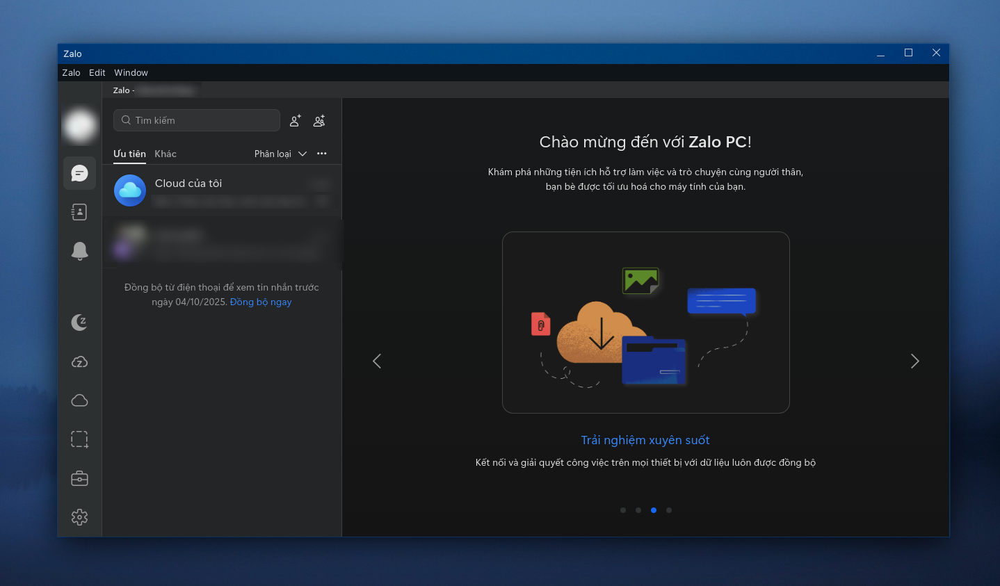
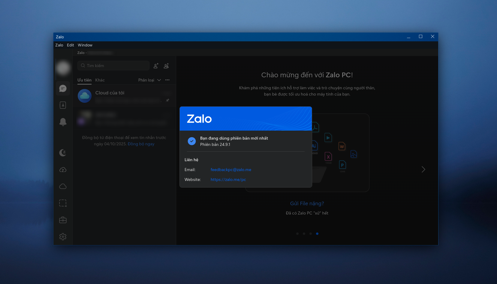
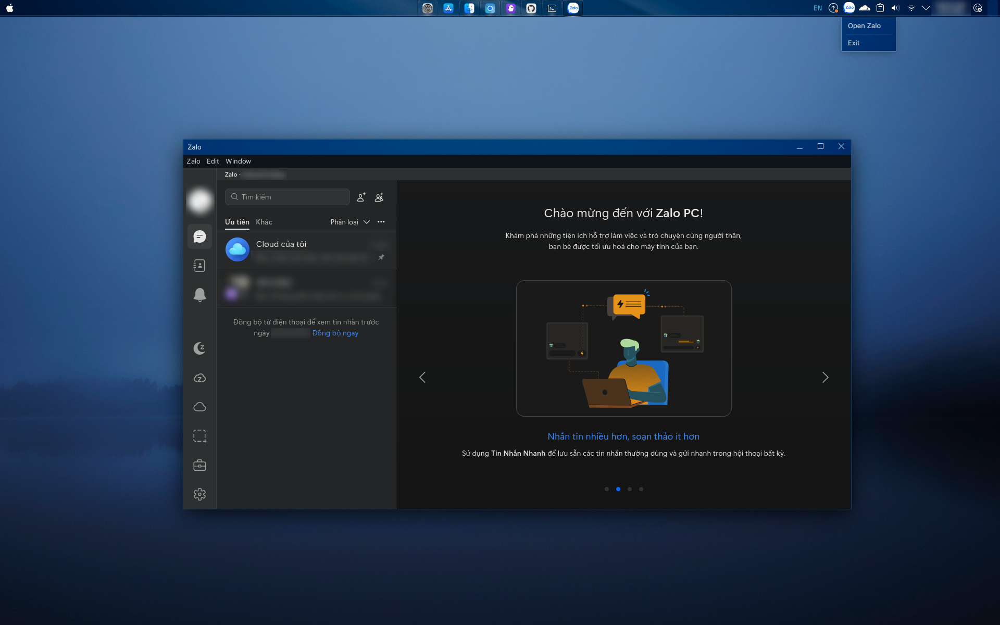

# Zalo for Linux



**An unofficial Linux port of Zalo messenger, ported directly from the macOS desktop client.**

[](releases/)
[](https://www.linux.org/)
[](#license)

---

## 📋 Table of Contents

- [Overview](#overview)
- [Features](#features)
- [Screenshots](#screenshots)
- [System Requirements](#system-requirements)
- [Installation](#installation)
- [Usage](#usage)
- [Available Variants](#available-variants)
- [Building from Source](#building-from-source)
- [Troubleshooting](#troubleshooting)
- [Known Limitations](#known-limitations)
- [Project Structure](#project-structure)
- [Security & Privacy](#security--privacy)
- [Contributing](#contributing)
- [License](#license)
- [Credits](#credits)

---

## 🎯 Overview

This is an **unofficial port** of the Zalo messenger application for Linux, based on the macOS desktop client. Unlike web-based solutions, this port provides a native desktop experience with full Electron integration.

### What is Zalo?

Zalo is a popular Vietnamese messaging application developed by VNG Corporation, offering text messaging, voice/video calls, and file sharing capabilities.

### How This Port Works

The porting process involved:

1. Extracting the `.dmg` file from the macOS Zalo client
2. Locating the `app.asar` file in `/Applications/Zalo.app/Contents/Resources`
3. Extracting and deobfuscating the application code
4. Adapting it to run on Linux using Electron v22.3.27
5. Implementing Linux-specific features (system tray, window controls, Wayland support)

**Important:** This port uses Electron v22.3.27 specifically. Newer versions may cause compatibility issues.

---

## ✨ Features

### Working Features ✅

- ✅ **Real-time messaging** - Send and receive text messages instantly
- ✅ **File sharing** - Share images, documents, and other files
- ✅ **Native system tray** - Minimize to system tray (KDE Plasma, GNOME)
- ✅ **Window controls** - Native window frame with minimize, maximize, close buttons
- ✅ **Wayland support** - Full compatibility with Wayland display server
- ✅ **X11 support** - Works on traditional X11 systems
- ✅ **Desktop notifications** - Native Linux notifications
- ✅ **QR code login** - Login via QR code scanning
- ✅ **Phone number login** - Traditional phone number authentication
- ✅ **Dark theme** - Available in ZaDark variant
- ✅ **Multi-language** - English and Vietnamese interface

### Known Limitations ⚠️

- ❌ **Voice/Video calls** - Not supported (limitation from macOS port)
- ⚠️ **Message sync** - Messages sent to mobile cannot be synced to desktop
  - This is a known architectural limitation that cannot be easily fixed
  - Workaround: There is no workaround. There will never be, as this version is outdated.
- ⚠️ **Outdated Electron** - Uses Electron v22.3.27 (security updates pending)

---

## 📸 Screenshots






---

## 💻 System Requirements

### Minimum Requirements

- **OS**: Linux (any modern distribution)
- **Desktop Environment**: KDE Plasma, GNOME, XFCE, or others
- **Display Server**: X11 or Wayland
- **RAM**: 2 GB minimum, 4 GB recommended
- **Disk Space**: 500 MB for installation
- **Architecture**: x64 (64-bit)

### Tested Distributions

| Distribution | Version | Status |
|--------------|---------|--------|
| Fedora | 40+ | ✅ Fully tested |
| Nobara | 39 | ✅ Fully tested |
| Ubuntu | 22.04+ | ✅ Tested |
| Debian | 11+ | ⚠️ Should work |
| Arch Linux | Rolling | ⚠️ Should work |
| openSUSE | Leap 15+ | ⚠️ Should work |

### Desktop Environments

| Desktop | Status | Notes |
|---------|--------|-------|
| KDE Plasma | ✅ Recommended | Full support, native tray |
| GNOME | ✅ Supported | Requires extension for tray |
| XFCE | ✅ Supported | Full support |
| Cinnamon | ⚠️ Should work | Not tested |
| MATE | ⚠️ Should work | Not tested |

---

## 📦 Installation

### Quick Install (Recommended)

The fastest way to install Zalo on Linux:

```bash
sh -c "$(curl -sSL https://raw.githubusercontent.com/ruskicoder/zalo-linux/main/source-code/install_curl.sh)"
```

### Manual Installation

1. **Clone the repository:**

```bash
git clone https://github.com/ruskicoder/zalo-linux
cd zalo-linux/source-code
```

2. **Run the installer:**

```bash
chmod +x install.sh
./install.sh
```

3. **Follow the prompts:**
   - Select language (English/Vietnamese)
   - Choose variant (Standard Zalo or ZaDark)

### Installation Locations

After installation, files will be located at:

| Item | Location |
|------|----------|
| Application | `~/.local/share/Zalo/` |
| Electron Binary | `~/.local/share/Zalo/electron-v22.3.27-linux-x64/` |
| Desktop Entry | `~/.local/share/applications/Zalo.desktop` |
| User Config | `~/.config/zalo/` |
| User Data | `~/.local/share/zalo/` |

---

## 🚀 Usage

### Launching Zalo

After installation, you can launch Zalo in several ways:

1. **From Application Menu:**
   - Search for "Zalo" in your application launcher

2. **From Desktop Icon:**
   - Double-click the Zalo icon on your desktop

3. **From Terminal:**

```bash
~/.local/share/Zalo/start.sh
```

### First-Time Setup

1. Launch Zalo
2. Choose login method:
   - **QR Code**: Scan with your mobile Zalo app
   - **Phone Number**: Enter your phone number and verification code
3. Wait for synchronization to complete
4. Start messaging!

### System Tray

- Click the tray icon to show/hide the window
- Right-click for menu options (Open/Exit)
- Closing the window minimizes to tray

---

## 🎨 Available Variants

### Standard Zalo

The standard version with the default Zalo interface.

**Features:**

- Standard light theme
- All core messaging features
- ~132 MB installed size

**Install:**

```bash
./install.sh
# Select option 1 when prompted
```

### ZaDark (Dark Theme)

Enhanced version with dark theme and additional customization options.

**Features:**

- Dark theme support
- Theme customization
- Privacy features (hide typing indicators, read receipts)
- Font customization
- Keyboard shortcuts
- Enhanced tooltips
- ~132.4 MB installed size (+377 KB for theme engine)

**Install:**

```bash
./install.sh
# Select option 2 when prompted
```

**ZaDark-Specific Libraries:**

- jQuery 3.x
- Tippy.js (tooltips)
- Intro.js (onboarding)
- LocalForage (settings storage)
- Hotkeys.js (keyboard shortcuts)
- Toastify (notifications)

---

## 🔧 Building from Source

### Prerequisites

Install required dependencies:

**Fedora/RHEL:**

```bash
sudo dnf install nodejs npm libXScrnSaver gtk3 nss alsa-lib
```

**Ubuntu/Debian:**

```bash
sudo apt install nodejs npm libxss1 libgtk-3-0 libnss3 libasound2
```

**Arch Linux:**

```bash
sudo pacman -S nodejs npm libxss gtk3 nss alsa-lib
```

### Build Steps

1. **Navigate to source directory:**

```bash
cd source-code/Zalo  # or source-code/ZaDark
```

2. **Download Electron:**

```bash
wget https://github.com/electron/electron/releases/download/v22.3.27/electron-v22.3.27-linux-x64.zip
unzip electron-v22.3.27-linux-x64.zip -d electron-v22.3.27-linux-x64
rm electron-v22.3.27-linux-x64.zip
```

3. **Run from source:**

```bash
./start-dev.sh
```

### Development Mode

For development with debugging enabled:

```bash
export NODE_ENV=development
./start-dev.sh --enable-logging --v=1
```

**Enable DevTools:**

- Press `Ctrl+Shift+I` in the application
- Or add `--remote-debugging-port=9222` to start script

### Complete Documentation

For detailed build instructions, see:

- [source-code/README.md](source-code/README.md) - Complete source overview
- [source-code/BUILD-INSTRUCTIONS.md](source-code/BUILD-INSTRUCTIONS.md) - Detailed build guide
- [source-code/STRUCTURE.md](source-code/STRUCTURE.md) - Project structure

---

## 🔍 Troubleshooting

### Common Issues

#### 1. Application Won't Start

**Check logs:**

```bash
cat ~/.config/zalo/logs/main.log
cat ~/.config/zalo/logs/renderer.log
```

**Reinstall:**

```bash
~/.local/share/Zalo/uninstall.sh
./install.sh
```

#### 2. Chrome Sandbox Error

```
FATAL:setuid_sandbox_host.cc(157)] The SUID sandbox helper binary was found, 
but is not configured correctly.
```

**Fix:**

```bash
sudo chown root $HOME/.local/share/Zalo/electron-v22.3.27-linux-x64/chrome-sandbox
sudo chmod 4755 $HOME/.local/share/Zalo/electron-v22.3.27-linux-x64/chrome-sandbox
```

#### 3. System Tray Not Showing

**GNOME users:**

Install GNOME Shell extension for system tray:

```bash
# Install AppIndicator extension
sudo apt install gnome-shell-extension-appindicator  # Ubuntu/Debian
sudo dnf install gnome-shell-extension-appindicator  # Fedora
```

Then enable it in GNOME Extensions.

#### 4. Missing Dependencies

**Check for missing libraries:**

```bash
ldd ~/.local/share/Zalo/electron-v22.3.27-linux-x64/electron
```

**Install missing dependencies:**

**Fedora:**

```bash
sudo dnf install libXScrnSaver libappindicator-gtk3
```

**Ubuntu/Debian:**

```bash
sudo apt install libxss1 libappindicator3-1
```

**Arch:**

```bash
sudo pacman -S libxss libappindicator-gtk3
```

#### 5. Wayland Window Controls Not Working

This should be fixed in v0.0.1-rev.02. If you still experience issues:

**Force X11 mode:**

```bash
GDK_BACKEND=x11 ~/.local/share/Zalo/start.sh
```

#### 6. Login Issues

- Ensure you have a stable internet connection
- Try clearing cache: `rm -rf ~/.config/zalo/Cache`
- Try alternative login method (QR code vs phone number)

---

## ⚠️ Known Limitations

### Message Synchronization

**Issue:** Messages sent to your mobile device cannot be synced to the desktop app.

**Cause:** The sync controller initialization chain is broken in the Linux port. This is an architectural limitation inherited from the macOS port adaptation.

**Workaround:**

- None. I have no capability to fix this. The problem cannot be fixed and will never be.

**Status:** Documented as known limitation. Cannot be fixed without official Zalo Linux support or significant reverse engineering effort.

### Voice/Video Calls

**Issue:** Voice and video calling features are not functional.

**Cause:** This is a limitation from the macOS port. The calling infrastructure requires platform-specific implementations that are not available in this port.

**Status:** Not supported in current version.

### Electron Version

**Issue:** Using Electron v22.3.27 (released 2023), which is outdated.

**Cause:** Newer Electron versions cause compatibility issues with the ported code.

**Security Impact:** Missing security updates from newer Electron versions.

**Status:** Planned for future update (requires code adaptation).

---

## 📁 Project Structure

```
zalo-linux-unofficial/
├── source-code/              # Complete buildable source code
│   ├── Zalo/                # Standard Zalo variant
│   │   ├── assets/          # Icons and images
│   │   ├── start.sh         # Production start script
│   │   ├── start-dev.sh     # Development start script
│   │   └── Zalo/            # Application directory
│   │       └── app/         # Application files
│   │           ├── main-dist/      # Main process (11 files, ~21MB)
│   │           ├── pc-dist/        # Renderer process (53 files, ~111MB)
│   │           ├── lib/            # Electron framework
│   │           ├── native/         # Native modules (.node files)
│   │           ├── bootstrap.js    # Bootstrap script
│   │           ├── package.json    # Package configuration
│   │           ├── ARCHITECTURE.md # Architecture docs
│   │           ├── ANALYSIS-main.md    # Main process analysis
│   │           └── ANALYSIS-renderer.md # Renderer analysis
│   │
│   ├── ZaDark/              # ZaDark variant (dark theme)
│   │   └── [Same structure as Zalo + 14 ZaDark theme files]
│   │
│   ├── prepare/             # Desktop entry files
│   ├── en/                  # English localization
│   ├── vn/                  # Vietnamese localization
│   ├── install.sh           # Installation script
│   ├── uninstall.sh         # Uninstallation script
│   ├── update.sh            # Update script
│   ├── README.md            # Source code overview
│   ├── BUILD-INSTRUCTIONS.md # Build guide
│   ├── STRUCTURE.md         # Structure documentation
│   └── FUNCTION-INDEX.md    # Function catalog (~20,000 functions)
│
├── releases/                # Release notes
│   └── RELEASE-NOTES-v0.0.1-rev.02.md
│
├── utils/                   # Development utilities
│   ├── deobfuscate.js      # Code deobfuscation
│   ├── add-code-comments.js # Comment generation
│   └── analyze-code.js     # Code analysis
│
├── README.md               # This file
├── install.sh              # Main installer
├── install_curl.sh         # Curl-based installer
└── package.json            # Dev dependencies
```

### Key Files

| File | Purpose |
|------|---------|
| `install.sh` | Interactive installer with language/variant selection |
| `source-code/Zalo/Zalo/app/main-dist/main.js` | Main Electron process (36,793 lines) |
| `source-code/Zalo/Zalo/app/pc-dist/zd-worker.js` | Core business logic (8.1 MB) |
| `source-code/FUNCTION-INDEX.md` | Searchable catalog of ~20,000 functions |

---

### Data Storage

User data is stored locally at:

- Configuration: `~/.config/zalo/`
- Messages/Media: `~/.local/share/zalo/`
- Logs: `~/.config/zalo/logs/`

**To completely remove all data:**

```bash
~/.local/share/Zalo/uninstall.sh
rm -rf ~/.config/zalo ~/.local/share/zalo
```

---

## 🤝 Contributing

Contributions are welcome! Here's how you can help:

### Reporting Issues

1. Check existing issues first
2. Provide system information (OS, desktop environment, Electron version)
3. Include steps to reproduce
4. Attach relevant logs from `~/.config/zalo/logs/`

### Code Contributions

1. Fork the repository
2. Create a feature branch (`git checkout -b feature/amazing-feature`)
3. Make your changes
4. Test thoroughly on multiple distributions
5. Commit with clear messages (`git commit -m 'Add amazing feature'`)
6. Push to your fork (`git push origin feature/amazing-feature`)
7. Open a Pull Request

### Development Guidelines

- Follow existing code style
- Add comments for complex logic
- Update documentation for new features
- Test on both X11 and Wayland
- Ensure compatibility with KDE Plasma and GNOME

---

## 📄 License

This is an **unofficial port** for educational and personal use.

- **Original Zalo Application**: © VNG Corporation. All rights reserved.
- **ZaDark Theme**: © ZaDark developers
- **Linux Port**: Community effort, no affiliation with VNG Corporation

**Disclaimer:** This project is not endorsed by, affiliated with, or supported by VNG Corporation or Zalo. Use at your own risk.

---

## 🙏 Credits

### Original Application

- **Zalo Messenger**: Developed by VNG Corporation
- **macOS Client**: VNG Corporation

### Linux Port

- **Port Maintainer**: [ruskicoder](https://github.com/ruskicoder)
- **Wayland Fixes**: Community contributors
- **ZaDark Theme**: ZaDark project team
- **Code Deobfuscation**: Security audit team
- **Documentation**: Community contributors

### Technologies Used

- **Electron**: v22.3.27
- **React**: UI framework
- **Redux**: State management
- **Signal Protocol**: End-to-end encryption
- **SQLite**: Local database
- **Node.js**: Runtime environment

### Special Thanks

- All contributors who helped test and improve this port
- The Electron community for documentation and support
- Linux desktop environment developers (KDE, GNOME, XFCE)

---

## 📞 Support & Links

- **GitHub Repository**: [zalo-linux](https://github.com/ruskicoder/zalo-linux)
- **Issue Tracker**: [GitHub Issues](https://github.com/ruskicoder/zalo-linux/issues)
- **Release Notes**: [releases/](releases/)
- **Source Documentation**: [source-code/README.md](source-code/README.md)

### Official Zalo Resources

- **Official Website**: [zalo.me](https://zalo.me)
- **Official Support**: [support.zalo.me](https://support.zalo.me)
- **Mobile Apps**: Available on Google Play and App Store

---

## 📊 Project Statistics

- **Total Files**: 143 JavaScript files (deobfuscated)
- **Total Size**: ~132 MB (beautified code)
- **Functions Cataloged**: ~20,000 functions
- **Lines of Code**: Main process: 36,793 lines
- **Supported Platforms**: Linux x64
- **Electron Version**: v22.3.27
- **Current Version**: v0.0.1-rev.02

---

**Made with ❤️ for the Linux community**

**Enjoy Zalo on Linux! 🐧**
